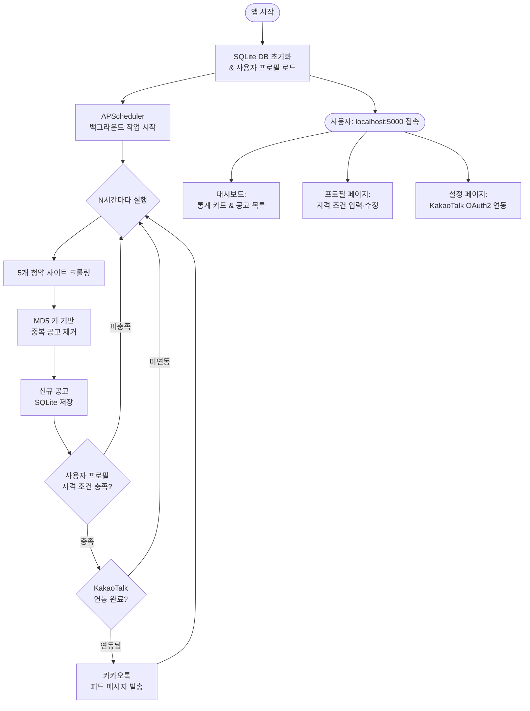
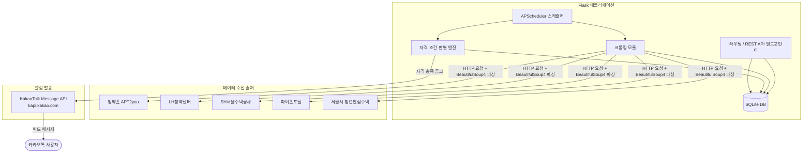

# Housing Subscription Alert System

<div align="center">


</div>

**청약 공고를 자동으로 수집하고 카카오톡으로 알려주는 청약알리미 서비스**

---

## 📌 개요

5개의 공공 청약 사이트를 주기적으로 크롤링하여 신규 분양·임대 공고를 수집하고, 사용자 프로필(나이, 소득, 자산, 지역 등)에 맞는 공고를 필터링해 KakaoTalk 메신저로 자동 알림을 발송하는 Flask 기반 자동화 서비스입니다.

웹 대시보드를 통해 청약 공고 목록 조회, 자격 조건 설정, KakaoTalk API 연동 설정을 모두 관리할 수 있습니다.

---

## ✨ 주요 기능

| # | 기능명 | 설명 |
|---|--------|------|
| 1 | **다중 사이트 크롤링** | 5개 공공 청약 포털에서 신규 공고를 N시간마다 자동 수집 |
| 2 | **자격 조건 필터링** | 사용자 프로필(나이·소득·자산·청약통장·선호 지역)과 공고를 자동 매칭하여 적합 여부 판별 |
| 3 | **카카오톡 알림 발송** | 적합 공고 발생 시 KakaoTalk Message API를 통해 상세 정보와 링크를 포함한 피드형 메시지 발송 |
| 4 | **웹 대시보드** | Bootstrap 5 기반 UI로 통계 카드, 공고 목록, 자격 배지 등 한눈에 확인 가능 |
| 5 | **프로필 관리** | 개인·재무 정보를 입력하면 자격 조건이 실시간으로 재산정됨 |
| 6 | **OAuth2 토큰 연동** | KakaoTalk OAuth2 인증 흐름 단계별 안내 및 자동 토큰 갱신 |
| 7 | **중복 알림 방지** | MD5 키 기반 중복 제거로 동일 공고 재알림 방지 |

---

## 🛠 기술 스택

| 분류 | 기술 | 역할 |
|------|------|------|
| 웹 프레임워크 | Flask 3.x | HTTP 서버, 라우팅, Jinja2 템플릿 렌더링 |
| 데이터베이스 | Flask-SQLAlchemy + SQLite | 공고·프로필·토큰 영구 저장 |
| 스케줄러 | APScheduler (BackgroundScheduler) | 주기적 크롤링 및 알림 작업 실행 |
| 크롤링 | requests + BeautifulSoup4 | HTTP 요청 및 HTML 파싱 |
| 알림 | KakaoTalk Message API | 개인 카카오톡 계정으로 피드 메시지 발송 |
| 프론트엔드 | Bootstrap 5 | 반응형 대시보드 UI |
| 실행 환경 | Python ≥ 3.14, uv | 패키지 관리 및 실행 |
| 배포 플랫폼 | Windows | install.bat / run.bat 원클릭 실행 스크립트 |

---

## 📊 데이터 수집 출처

| # | 사이트명 | URL | 수집 내용 |
|---|----------|-----|-----------|
| 1 | 청약홈 (APT2you) | [applyhome.co.kr](https://www.applyhome.co.kr) | 아파트·오피스텔 분양 공고 |
| 2 | LH청약센터 | [apply.lh.or.kr](https://apply.lh.or.kr) | 공공임대, 청년 전세임대, 행복주택 공고 |
| 3 | SH서울주택공사 | [i-sh.co.kr](https://www.i-sh.co.kr) | 서울시 공공주택 공고 |
| 4 | 마이홈포털 | [myhome.go.kr](https://www.myhome.go.kr) | 국토부 산하 전국 공공임대 공고 |
| 5 | 서울시 청년안심주택 | [soco.seoul.go.kr](https://soco.seoul.go.kr/youth/bbs/BMSR00015/list.do?menuNo=400008) | 서울시 청년 특화 임대주택 공고 |

---

## 📁 프로젝트 구조

```
notice/
├── app.py              # Flask 통합 앱 (모델·크롤러·자격 판별·라우팅·스케줄러 일체형)
├── scraper.py          # 5개 사이트 크롤링 모듈 (개별 테스트용)
├── eligibility.py      # 사용자 자격 조건 판별 엔진
├── models.py           # SQLAlchemy 모델 (UserProfile, Listing, NotificationLog)
├── kakao.py            # KakaoTalk OAuth2 인증 및 메시지 발송 모듈
├── requirements.txt    # pip 의존성 목록
├── pyproject.toml      # uv / PEP 517 프로젝트 설정
├── install.bat         # 원클릭 설치 스크립트 (파일 복사 → uv sync → 앱 실행)
├── run.bat             # 재실행 단축 스크립트 (uv run app.py)
├── templates/
│   ├── base.html       # Jinja2 공통 레이아웃
│   ├── index.html      # 메인 대시보드 (공고 목록·통계)
│   ├── profile.html    # 프로필·자격 조건 입력 폼
│   └── settings.html   # KakaoTalk API 연동 설정
└── static/
    └── css/            # 커스텀 스타일시트
```

> `app.py`는 모든 기능이 통합된 단일 파일 버전입니다. 나머지 모듈(scraper.py, eligibility.py 등)은 개발·테스트용 분리 버전입니다.

---

## 🚀 시작하기

### 필수 조건

- Python ≥ 3.14
- [uv](https://docs.astral.sh/uv/) 패키지 매니저

### 설치 및 실행 (Windows)

```bat
install.bat
```

프로젝트 파일을 `C:\cheongak`에 복사하고, `uv sync` 후 앱을 자동으로 실행합니다.

### 이후 재실행

```bat
run.bat
```

또는 직접 실행:

```bash
uv run app.py
```

브라우저에서 **http://localhost:5000** 접속

### 비Windows 환경 수동 설치

```bash
pip install -r requirements.txt   # 또는: uv sync
python app.py
```

---

### KakaoTalk API 설정 방법

1. [developers.kakao.com](https://developers.kakao.com)에 접속하여 애플리케이션 생성
2. 플랫폼 → 웹 → `http://localhost:5000` 추가
3. 카카오 로그인 → 활성화 → Redirect URI에 `http://localhost:5000/kakao/callback` 추가
4. 동의항목 → **카카오톡 메시지 전송 (talk_message)** 활성화
5. REST API 키 복사 후 앱 내 `/settings` 페이지에 붙여넣기

### 환경 변수

| 변수명 | 설명 | 설정 위치 |
|--------|------|-----------|
| `KAKAO_REST_API_KEY` | OAuth2 인증용 카카오 REST API 키 | `/settings` 페이지 UI |
| `KAKAO_ACCESS_TOKEN` | OAuth2 액세스 토큰 (로그인 후 자동 저장) | 앱이 SQLite에서 자동 관리 |
| `KAKAO_REFRESH_TOKEN` | OAuth2 리프레시 토큰 (자동 갱신) | 앱이 SQLite에서 자동 관리 |
| `SCRAPE_INTERVAL_HOURS` | 크롤링 실행 주기 (기본값: 6시간) | `app.py` 설정 |

---

## 🔄 동작 흐름



---

## 🏗 아키텍처



---

## 🎯 습득 기술 및 역량

| 역량 분야 | 구현 내용 |
|-----------|-----------|
| **웹 크롤링** | requests + BeautifulSoup4를 활용하여 5개 정부·공공기관 포털의 HTML 파싱, 페이지네이션 처리, 다양한 DOM 구조 대응 |
| **REST API 연동** | KakaoTalk OAuth2 전체 흐름 구현 (인가 코드 → 액세스 토큰 → 자동 갱신) 및 피드형 메시지 발송 |
| **자동화 스케줄링** | APScheduler BackgroundScheduler를 이용한 주기적 작업 실행, HTTP 요청 사이클과 독립적으로 동작 |
| **데이터베이스 설계** | SQLAlchemy ORM으로 공고·프로필·알림 로그 모델링, MD5 기반 중복 제거 전략 적용 |
| **웹 애플리케이션 개발** | Flask 라우팅, Jinja2 템플릿, Bootstrap 5 UI로 대시보드·프로필·설정 멀티 페이지 구성 |
| **자동화 파이프라인** | 크롤링 → 필터링 → 카카오톡 알림까지 스케줄 기반으로 무인 자동 처리되는 엔드투엔드 파이프라인 구현 |
| **Windows 배포** | .bat 런처 스크립트로 Python 환경 설정 없이 원클릭 설치 및 실행 가능 |

---

## 📄 라이선스

이 프로젝트는 오픈소스입니다. 크롤링 대상은 한국 정부 및 공공 주택 기관 포털이며, 사이트 구조 변경 시 `scraper.py` 또는 `app.py`의 URL 및 파싱 로직을 업데이트해야 합니다.

> **참고 사이트:** [청약홈](https://www.applyhome.co.kr) · [LH청약센터](https://apply.lh.or.kr) · [SH서울주택공사](https://www.i-sh.co.kr) · [마이홈포털](https://www.myhome.go.kr) · [SOCO 청년안심주택](https://soco.seoul.go.kr) · [Kakao Developers](https://developers.kakao.com)
