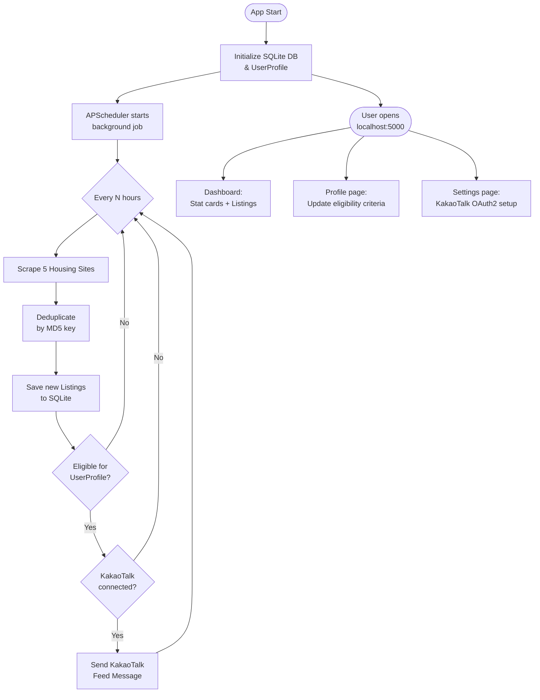
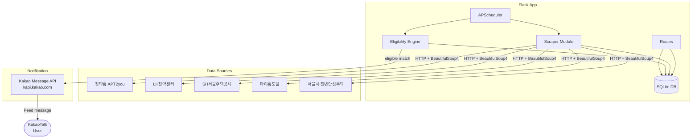

# Housing Subscription Alert System

<div align="center">


</div>

---

## 📌 Overview

A self-hosted Flask web application that automatically scrapes Korean public housing subscription (청약) listings from 5 official sources, evaluates eligibility against your personal profile, and delivers matched alerts directly to your KakaoTalk messenger on a scheduled interval.

---

## ✨ Features

| # | Feature | Description |
|---|---------|-------------|
| 1 | **Multi-Source Scraping** | Collects new listings from 5 official Korean housing portals every N hours |
| 2 | **Eligibility Engine** | Evaluates each listing against user profile (age, income, assets, 청약통장, region preferences) |
| 3 | **KakaoTalk Alerts** | Sends feed-style push notifications with listing details and direct links via Kakao API |
| 4 | **Web Dashboard** | Bootstrap 5 UI with stat cards, eligible listings, and a full table with eligibility badges |
| 5 | **Profile Management** | Enter and update personal/financial info; eligibility recalculated live |
| 6 | **OAuth2 Token Flow** | Step-by-step KakaoTalk OAuth2 setup with automatic token refresh |
| 7 | **Duplicate Prevention** | MD5-keyed deduplication across scrape runs to avoid repeat notifications |

---

## 🛠 Tech Stack

| Category | Technology | Purpose |
|----------|-----------|---------|
| Web Framework | Flask 3.x | HTTP server, routing, Jinja2 templates |
| Database | Flask-SQLAlchemy + SQLite | Persistent storage for listings, profile, tokens |
| Scheduler | APScheduler (BackgroundScheduler) | Periodic scrape & notification jobs |
| Scraping | requests + BeautifulSoup4 | HTTP fetching and HTML parsing |
| Notification | KakaoTalk Message API | Push alerts to personal KakaoTalk account |
| Frontend | Bootstrap 5 | Responsive dashboard UI |
| Runtime | Python ≥ 3.14, uv | Package management and execution |
| Platform | Windows | install.bat / run.bat launcher scripts |

---

## 📁 Project Structure

```
notice/
├── app.py              # Single-file Flask app (models, scraper, eligibility, routes, scheduler)
├── scraper.py          # Standalone scraper module (5 sources)
├── eligibility.py      # Eligibility check engine
├── models.py           # SQLAlchemy models (UserProfile, Listing, NotificationLog)
├── kakao.py            # KakaoTalk OAuth2 + send module
├── requirements.txt    # pip dependencies
├── pyproject.toml      # uv/PEP 517 project config
├── install.bat         # One-shot install: copies files, runs uv sync + app
├── run.bat             # Re-launch shortcut (uv run app.py)
├── templates/
│   ├── base.html       # Jinja2 base layout
│   ├── index.html      # Dashboard
│   ├── profile.html    # Profile / eligibility form
│   └── settings.html   # KakaoTalk setup
└── static/
    └── css/            # Custom CSS
```

> `app.py` is a self-contained single-file version that inlines models, scraper, eligibility, and Kakao logic. The sibling modules are the modular equivalents for development/testing.

---

## 🚀 Getting Started

### Prerequisites

- Python ≥ 3.14
- [uv](https://docs.astral.sh/uv/) package manager

### Installation (Windows)

```bat
install.bat
```

Copies project files to `C:\cheongak`, runs `uv sync`, and launches the app automatically.

### Subsequent Runs

```bat
run.bat
```

or manually:

```bash
uv run app.py
```

Then open **http://localhost:5000** in your browser.

### Manual Install (non-Windows)

```bash
pip install -r requirements.txt   # or: uv sync
python app.py
```

---

### KakaoTalk Notification Setup

1. Go to [developers.kakao.com](https://developers.kakao.com) and create an app
2. Platform → Web → add `http://localhost:5000`
3. Kakao Login → activate → add Redirect URI: `http://localhost:5000/kakao/callback`
4. Consent items → enable **카카오톡 메시지 전송** (talk_message)
5. Copy your **REST API key** and paste it in the `/settings` page of the running app

### Environment Variables

| Variable | Description | Where to Set |
|----------|-------------|--------------|
| `KAKAO_REST_API_KEY` | Kakao REST API key for OAuth2 authentication | `/settings` page UI |
| `KAKAO_ACCESS_TOKEN` | OAuth2 access token (auto-stored after login) | Managed by app (SQLite) |
| `KAKAO_REFRESH_TOKEN` | OAuth2 refresh token (auto-rotated) | Managed by app (SQLite) |
| `SCRAPE_INTERVAL_HOURS` | How often to run the scraper (default: 6) | `app.py` config |

---

## 🔄 Usage Flow



---

## 🏗 Architecture



---

## 📊 Data Sources

| # | Source | Type |
|---|--------|------|
| 1 | [청약홈 (APT2you)](https://www.applyhome.co.kr) | Apartment & officetel listings |
| 2 | [LH청약센터](https://apply.lh.or.kr) | Public rental, youth jeonse, happy housing |
| 3 | [SH서울주택공사](https://www.i-sh.co.kr) | Seoul public housing |
| 4 | [마이홈포털](https://www.myhome.go.kr) | National public rental (국토부) |
| 5 | [서울시 청년안심주택](https://soco.seoul.go.kr/youth/bbs/BMSR00015/list.do?menuNo=400008) | Seoul youth-safe housing |

---

## 🎯 Skills Demonstrated

| Skill Area | Implementation |
|------------|---------------|
| **Web Scraping** | Multi-target HTML scraping with `requests` + `BeautifulSoup4` across 5 government portals; handles pagination and varied DOM structures |
| **REST API Integration** | Full KakaoTalk OAuth2 flow (authorization code → access token → auto-refresh) and feed-type message delivery via Kakao Message API |
| **Task Scheduling** | Background job scheduling with `APScheduler`; configurable interval, runs independently of HTTP request cycle |
| **Database Design** | SQLAlchemy ORM models for listings, user profile, and notification logs; MD5-based deduplication strategy |
| **Web Application** | Flask routing, Jinja2 templating, Bootstrap 5 UI; multi-page app with dashboard, profile, and settings views |
| **Automation** | End-to-end pipeline: scrape → filter → notify, triggered on schedule with no manual intervention required |
| **Windows Deployment** | `.bat` launcher scripts for one-click install and run on Windows without manual Python environment management |

---

## 📄 License

This project is open source. Scraping targets are Korean government and public housing portals — site structure may change; update URL/parsing logic in `scraper.py` or `app.py` accordingly.

> **References:** [청약홈](https://www.applyhome.co.kr) · [LH청약센터](https://apply.lh.or.kr) · [SH서울주택공사](https://www.i-sh.co.kr) · [마이홈포털](https://www.myhome.go.kr) · [SOCO 청년안심주택](https://soco.seoul.go.kr) · [Kakao Developers](https://developers.kakao.com)
